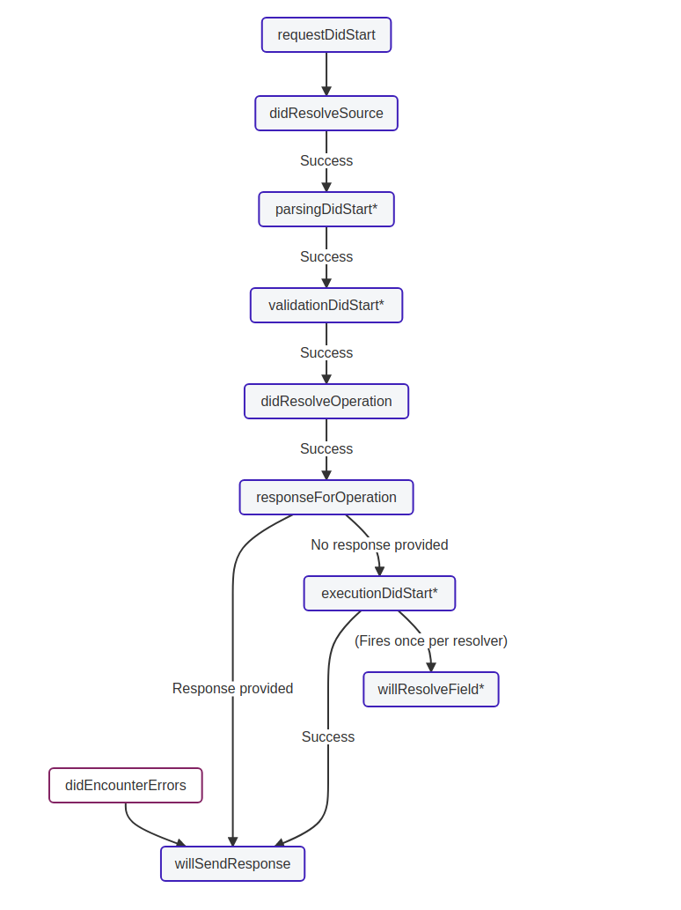

# Apollo-Plugin-Sentry

[](https://github.com/prettier/prettier)
<a href="https://gitmoji.dev">

</a>

<br/>

An Apollo Plugin for Sentry Monitoring 🔍

[Tracking Errors in Apollo GraphQL with Sentry](https://medium.com/@mahyor.sam/tracking-errors-in-apollo-graphql-with-sentry-549ae52c0c76)

<br/>

## How it works

Apollo server uses lifecycle events, enabling us to easily instrument an app for sentry integration.

Here's a visual diagram of the flow of lifecycle events. Learn more at the [Apollo Plugin Docs 📚](https://www.apollographql.com/docs/apollo-server/integrations/plugins/)



<br/>

## Install

```bash
# yarn
yarn add @pointblankdev/apollo-plugin-sentry

# npm
npm install @pointblankdev/apollo-plugin-sentry
```

<br/>

## Usage

🚧 Work in progress 🚧

<br/>
